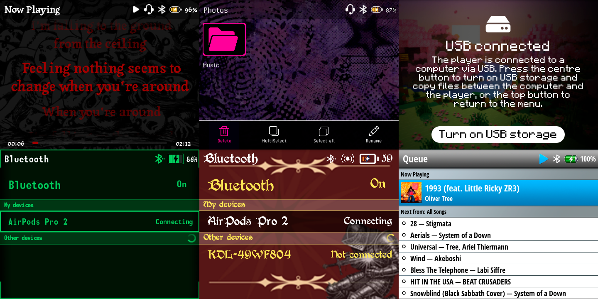
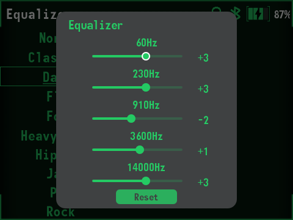

Settings marked with ⚙️ are new rows in the better-Y menu.

### System

⚙️ <b>Data backup</b> — settings, likes, playlists, bookmarks and reading progress

Updating the firmware with an updater wipes the user data, so in order to keep it after an update you can use "Data backup" button. 
It saves everything to `/better-Y/backup/` on the SD card and you can load it back after you updated to a newer version.

Along with the better-Y settings, the archive keeps the theme, the stock settings, the library with
playlists, bookmarks and audiobook progress, the e-book reader, brightness, screen timeout, key
tone, key vibration and the clock. Bluetooth pairings can't be saved.

<b>Extended themes support</b> — screens that were previously hardcoded now use the theme designs

- **USB connected**
- **Loading windows**
- **Equalizer**
- **FM Radio**
- **Photos**
- **Wallpaper**
- **Search** and the **on-screen keyboard**
- **Brightness**
- **Bluetooth**

<b>Equalizer now shows each band's level in dB instead of just "-15" and "15"</b>

<table border="0" style="border-collapse: collapse; border: none;">
  <tr style="border: none; background: transparent; vertical-align: top;">
    <td width="400" align="center" valign="top" style="border: none; padding: 0 15px 0 0; width: 1px;">
      
    </td>
</table>

&#9679;&ensp;<b>Disabled scroll wheel sounds while the screen is off</b> — no more clicks in a pocket when Key lock is off

&#9679;&ensp;<b>Fixed a bug where the song order was reset when a song was added to the queue</b>

&#9679;&ensp;<b>Files of better-Y on the SD card are sorted into folders</b> — <code>/better-Y/logs/</code> and <code>/better-Y/backup/</code>

&#9679;&ensp;<b>E-book → Local files no longer lists the files of the /better-Y/ folder</b>

&#9679;&ensp;<b>Translation fixes and some other minor changes</b>

### Now Playing

⚙️ <b>Option to change text and lyrics color</b> — Light / Dark / Theme color

<table border="0" style="border-collapse: collapse; border: none; margin: 0; width: auto;">
  <!-- ВЕРХНИЙ РЯД: ДВЕ КАРТИНКИ -->
  <tr style="border: none; background: transparent; vertical-align: top;">
    <!-- Первая колонка (без отступа слева) -->
    <td width="400" align="center" valign="top" style="border: none; padding: 0 15px 0 0; width: 1px;">
      
      

        Icons and text color changed to `Light`
      

    </td>
    <!-- Вторая колонка -->
    <td width="400" align="center" valign="top" style="border: none; padding: 0 0 0 15px; width: 1px;">
      
      

        Icons and text color changed to `Theme color`
      

    </td>
  </tr>

  <!-- ОТСТУП МЕЖДУ РЯДАМИ -->
  <tr style="border: none; background: transparent; height: 20px;">
    <td colspan="2" valign="top" style="border: none; padding: 0;"></td>
  </tr>

  <!-- НИЖНИЙ РЯД: ТРЕТЬЯ КАРТИНКА ПО ЦЕНТРУ ПЕРВЫХ ДВУХ -->
  <tr style="border: none; background: transparent; vertical-align: top;">
    <td colspan="2" align="center" valign="top" style="border: none; padding: 0; text-align: center;">
      

        
        

          Lyrics color changed to `Theme color`
        

      

    </td>
  </tr>
</table>

⚙️ <b>Long artist/album scroll</b> — Off / Artists / Albums / Both

Long artist and album lines in the player can now scroll too. Long song titles always scroll,
regardless of the setting.

### Menu

<b>More sorting options</b> — in Folders and Audiobooks

- **Music/Audiobooks/Videos → Folders** — "Sort by File name".
- **Audiobooks → All audiobooks** and the chapters of a book — "Sort by File name".
- **Audiobooks → Artists** and **Albums** — "Sort by" → A-Z / Z-A.

<b>Photos section rework</b> — revised to reflect the changes and align with the other sections

- "Set as wallpaper" is no longer offered for a folder.
- Leaving a folder returns the grid to where it was, without scrolling down from the top.
- Opening a folder or a picture no longer shows a loading window.

&#9679;&ensp;<b>Faster and even more responsive scrolling</b> — up to 4x faster

&#9679;&ensp;<b>Queue, better-Y, Bluetooth, Themes gallery redesign</b>

&#9679;&ensp;<b>Folders are listed above files in Videos → Folders</b>

&#9679;&ensp;<b>New default folder and file icons in Folders</b> — they also follow the theme colors

&#9679;&ensp;<b>The song number column fix</b> — no longer cuts off with wide theme fonts and dynamically changes depending on the theme's font size

&#9679;&ensp;<b>"MultiSelect" is back in the menu while songs are selected</b>

&#9679;&ensp;<b>The alphabetical scroll letter no longer gets bigger with wide theme fonts</b>

&#9679;&ensp;<b>Settings and equalizer previews change right after a scroll</b> — without a delay

### Metadata

<b>Tags of MP3s with big embedded covers are read correctly</b> — titles, album artist, disc number and the cover itself

The stock firmware refuses to read an ID3 tag larger than 3 MB and silently falls back to the old ID3v1
tag. That tag has titles cut to 30 characters, no album artist, no disc
number, no cover — and no text encoding, so Cyrillic turned into hieroglyphs.

better-Y now reads such tags itself (ID3v2.2, 2.3 and 2.4). FLAC, M4A and OGG never had this
problem.

A library scanned by an older version is fixed once by pressing "Update library": on its first run
it re-reads every MP3 whose tag is over the limit, even if the file has not changed.

