# better-Y

A mod of the stock launcher for the **innioasis Y1**, based on 3.1.2 firmware.

## What it adds

There's a "better-Y" tab inside the Options menu — adjust the settings marked with ⚙️ to suit your needs. <br>
Within this tab press and hold the top button on the desired option to display its description and how it works.

### Metadata

<details>
<summary>⚙️ <b>Track numbers from metadata</b> — inside albums</summary>
<div style="padding: 16px 0 0">

It applies whatever the sort is: if sorted by file name - the numbers won't be in order.

If no track numbers are specified for the songs on the album, the stock numbers are used instead.

If track numbers are specified for only some of the songs, the songs without numbers will be moved to the bottom, and a "#" will appear in place of their track numbers.

</div>
</details>

<details>
<summary>⚙️ <b>Split artists that are divided by commas and semicolons</b></summary>
<div style="padding: 16px 0 0">

    System of a Down, RZA
    System of a Down; RZA

becomes two different artists, "System of a Down" and "RZA".

To keep an artist whose name contains a comma, use a semicolon — it takes priority:

    Tyler, The Creator; Frank Ocean

becomes two different artists, "Tyler, The Creator" and "Frank Ocean".

The same can be done with commas alone by adding the artist to `/better-Y/comma_artists.txt` on the SD card:

    Tyler, The Creator, Frank Ocean

becomes two different artists, "Tyler, The Creator" and "Frank Ocean".

</div>
</details>

<details>
<summary>⚙️ <b>Split genres that are divided by commas, semicolons and slashes</b></summary>
<div style="padding: 16px 0 0">

    Indie Rock, Acoustic
    Indie Rock; Acoustic
    Indie Rock / Acoustic
    Indie Rock/Acoustic

becomes two different genres, "Indie Rock" and "Acoustic".

</div>
</details>

<p style="display: flex; align-items: center">
<span style="display: inline-block; width: 17px; font-size: 0.85em; user-select: none;">●</span>
<span>⚙️ <b>Song titles from metadata</b> — instead of file names</span></p>

<details>
<summary><b>Album artist metadata tag support</b></summary>
<div style="padding: 16px 0 0">

Shown under the album names. If empty — the Artist tag is used instead.

</div>
</details>

<details>
<summary><b>External covers support</b> — <code>cover.*</code> and <code>folder.*</code></summary>
<div style="padding: 16px 0 0">

`cover.jpg` applies to every song with no embedded cover in that particular folder where it sits.

`folder.jpg` applies to every song with no embedded cover in that particular folder where it sits **AND** every folder inside of that folder.

Both come in `.jpg`, `.jpeg` and `.png`. Embedded cover > `cover.jpg` > `folder.jpg`, and the nearer
folder always wins. For example:

You can put `folder.jpg` into `/Eminem/` and every song without an embedded cover in that directory
will be using it. You can put `cover.jpg` into `/Eminem/Albums/The Eminem Show/` and it will override
the effect of `folder.jpg`. Meanwhile, songs with embedded covers ignore both of them and use their
own cover.

For the album's thumbnails the order is the other way round — `folder.*` → `cover.*` → the
embedded picture — because a `folder.jpg` was put there to stand for the whole album, while an
embedded cover belongs to one song. "Set as album thumbnail" overrides all of it.

</div>
</details>

<details>
<summary><b>Disk numbers support</b> — divide an album into CDs or vinyl Sides</summary>
<div style="padding: 16px 0 0">

<table border="0" style="border-collapse: collapse; border: none; width: max-content;">
  <!-- Первая строка: Картинки и их отдельные подписи -->
  <tr style="border: none; background: transparent; vertical-align: top;">
        <!-- Первая колонка -->
    <td style="border: none; padding: 0 15px 0 0; width: 1px;">
      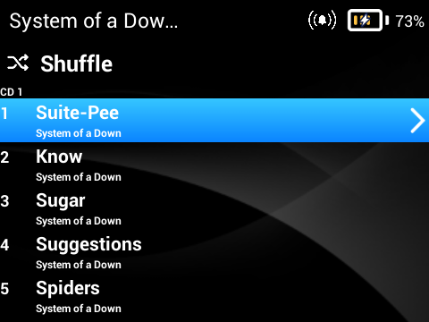
      <div style="padding-top: 8px; font-size: 14px; line-height: 1.4; text-align: center;">
        The list of songs in an album is divided into CD1, CD2 or Side A, Side B
      </div>
    </td>
    <!-- Вторая колонка -->
    <td style="border: none; padding: 0 0 0 15px; width: 1px;">
      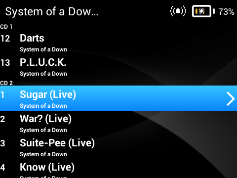
      <div style="padding-top: 8px; font-size: 14px; line-height: 1.4; text-align: center;">
        You can achieve it either by splitting an album into different folders (CD1, CD2, Side A, Side B, Disk 1, Disk 2, etc.) or by using a disk number tag in the metadata
      </div>
    </td>
</table>
</div>
</details>

### Now Playing

<details>
<summary>⚙️ <b>Interactive buttons</b> — Like, Shuffle, Repeat, Lyrics, AB Loop, Queue; Bookmark, Playback speed, Sleep timer</summary>
<div style="padding: 16px 0 0">

<table border="0" style="border-collapse: collapse; border: none; margin: 0; width: auto;">
  <!-- ВЕРХНИЙ РЯД: ДВЕ КАРТИНКИ -->
  <tr style="border: none; background: transparent; vertical-align: top;">
    <!-- Первая колонка (без отступа слева) -->
    <td style="border: none; padding: 0 15px 0 0; width: 1px;">
      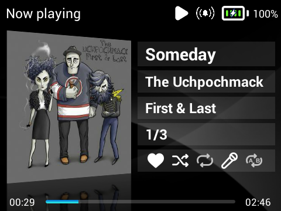
      <div style="padding-top: 8px; font-size: 14px; line-height: 1.4; text-align: center;">
        The set of interactive buttons changes depending on the "Top button hold" choice
      </div>
    </td>
    <!-- Вторая колонка -->
    <td style="border: none; padding: 0 0 0 15px; width: 1px;">
      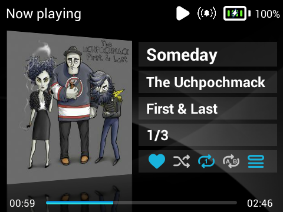
      <div style="padding-top: 8px; font-size: 14px; line-height: 1.4; text-align: center;">
        Supports Light / Dark / Theme colors
      </div>
    </td>
  </tr>

  <!-- ОТСТУП МЕЖДУ РЯДАМИ -->
  <tr style="border: none; background: transparent; height: 20px;">
    <td colspan="2" style="border: none; padding: 0;"></td>
  </tr>

  <!-- НИЖНИЙ РЯД: ТРЕТЬЯ КАРТИНКА ПО ЦЕНТРУ ПЕРВЫХ ДВУХ -->
  <tr style="border: none; background: transparent; vertical-align: top;">
    <td colspan="2" style="border: none; padding: 0; text-align: center;">
      <div style="display: inline-block; text-align: center;">
        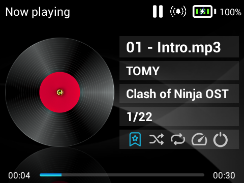
        <div style="padding-top: 8px; font-size: 14px; line-height: 1.4; text-align: center;">
          Bookmark, Playback speed and Sleep timer are exclusive to the audiobook player
        </div>
      </div>
    </td>
  </tr>
</table>

</div>
</details>

<details>
<summary>⚙️ <b>Album cover changes</b> — they're bigger, automatic crop and fill added, broken tilt is fixed; option to disable the tilt</summary>
<div style="padding: 16px 0 0">

<table border="0" style="border-collapse: collapse; border: none; width: max-content;">
  <!-- Первая строка: Картинки и их отдельные подписи -->
  <tr style="border: none; background: transparent; vertical-align: top;">
        <!-- Первая колонка -->
    <td style="border: none; padding: 0 15px 0 0; width: 1px;">
      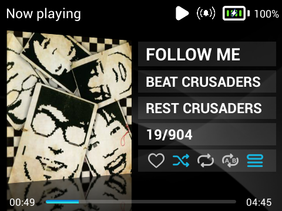
      <div style="padding-top: 8px; font-size: 14px; line-height: 1.4; text-align: center;">
        Cover tilt On
      </div>
    </td>
    <!-- Вторая колонка -->
    <td style="border: none; padding: 0 0 0 15px; width: 1px;">
      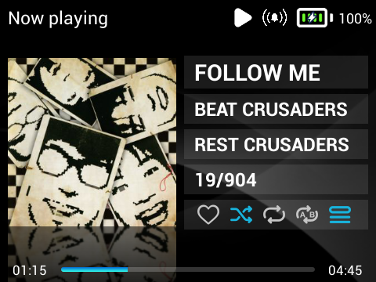
      <div style="padding-top: 8px; font-size: 14px; line-height: 1.4; text-align: center;">
        Cover tilt Off
      </div>
    </td>
</table>
</div>
</details>

<details>
<summary>⚙️ <b>A clean Now Playing screen</b> — hide artists and move them into the title</summary>
<div style="padding: 16px 0 0">

Two separate options: "Show only the first artist" and "Move hidden artists to the title" (the
latter can be enabled only when the former is).

    Tree, Shelf Nunny, Lena Kuhn — People

with "Move hidden artists" **Off** becomes

    Tree — People

with "Move hidden artists" **On** becomes

    Tree — People (feat. Shelf Nunny, Lena Kuhn)

Very convenient: that way you can have separated artists in the Artists tab and a clean Now Playing
screen at the same time, without compromises and without editing metadata.

</div>
</details>

<p style="display: flex; align-items: center">
<span style="display: inline-block; width: 17px; font-size: 0.85em; user-select: none;">●</span>
<span>⚙️ <b>Top button hold to open Lyrics / Queue / Bookmark / AB Loop</b></span></p>

<p style="display: flex; align-items: center">
<span style="display: inline-block; width: 17px; font-size: 0.85em; user-select: none;">●</span>
<span><b>Long song titles scroll</b></span></p>

<p style="display: flex; align-items: center">
<span style="display: inline-block; width: 17px; font-size: 0.85em; user-select: none;">●</span>
<span><b>Lyrics fix</b> — long lines no longer extend beyond the edges of the screen</span></p>

### Menu

<details>
<summary>⚙️ <b>Alphabetical scroll</b></summary>
<div style="padding: 16px 0 0">

<table border="0" style="border-collapse: collapse; border: none;">
  <tr style="border: none; background: transparent; vertical-align: top;">
    <!-- Первая колонка -->
    <td style="border: none; padding: 0 15px 0 0; width: 1px;">
      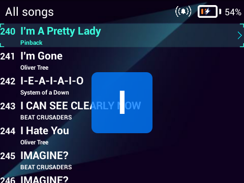
      <div style="padding-top: 8px; font-size: 14px; line-height: 1.4; text-align: center;">
        Starts after a number of wheel scrolls you choose
      </div>
    </td>
</table>

</div>
</details>

<details>
<summary>⚙️ <b>Selection follows currently playing song</b></summary>
<div style="padding: 16px 0 0">

When the screen is locked, and while the scroll wheel is at rest, the selection automatically follows the song currently playing

The selection switches to manual mode as soon as the scroll wheel is used. <br>
Once scrolling stops, a timer starts; after it expires, the selection moves to the currently playing song, and automatic mode resumes. <br>
Opening the context menu or MultiSelect mode resets the timer and pauses it.

When you open the list containing the currently playing song, the selection immediately moves to it. Exiting the player also sets the selection to it.

</div>
</details>

<details>
<summary>⚙️ <b>Show songs only by the selected artist inside Artists → Album</b></summary>
<div style="padding: 16px 0 0">

<table border="0" style="border-collapse: collapse; border: none;">
  <tr style="border: none; background: transparent; vertical-align: top;">
    <!-- Первая колонка -->
    <td style="border: none; padding: 0 15px 0 0; width: 1px;">
      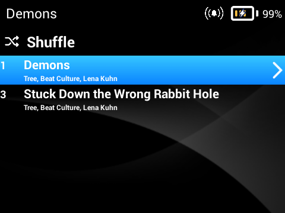
      <div style="padding-top: 8px; font-size: 14px; line-height: 1.4; text-align: center;">
        On, Beat Culture artist is selected
      </div>
    </td>
    <!-- Вторая колонка -->
    <td style="border: none; padding: 0 0 0 15px; width: 1px;">
      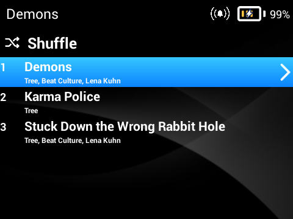
      <div style="padding-top: 8px; font-size: 14px; line-height: 1.4; text-align: center;">
        Off, Beat Culture artist is selected
      </div>
    </td>
  </tr>
</table>
</div>
</details>

<details>
<summary>⚙️ <b>Main menu and Settings margins fixes</b></summary>
<div style="padding: 16px 0 0">

<table border="0" style="border-collapse: collapse; border: none; width: max-content;">
  <!-- Первая строка: Картинки и их отдельные подписи -->
  <tr style="border: none; background: transparent; vertical-align: top;">
        <!-- Первая колонка -->
    <td style="border: none; padding: 0 15px 0 0; width: 1px;">
      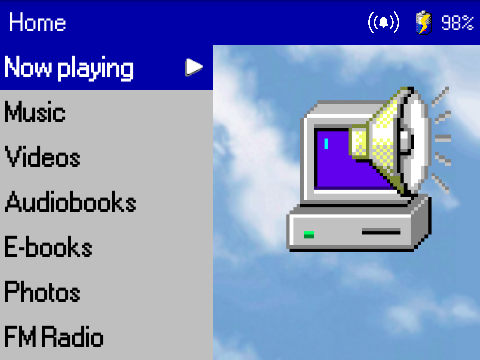
      <div style="padding-top: 8px; font-size: 14px; line-height: 1.4; text-align: center;">
        On, fixed margins
      </div>
    </td>
    <!-- Вторая колонка -->
    <td style="border: none; padding: 0 0 0 15px; width: 1px;">
      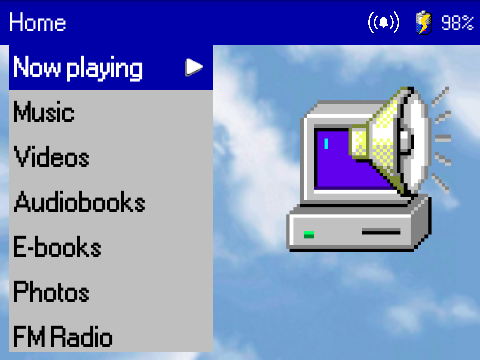
      <div style="padding-top: 8px; font-size: 14px; line-height: 1.4; text-align: center;">
        Off, stock margins
      </div>
    </td>

  </tr>
  <!-- Вторая строка: Общий текст по центру -->
  <tr style="border: none; background: transparent;">
    <td colspan="2" style="border: none; padding-top: 20px; text-align: center; font-size: 15px; line-height: 1.5;">
      Worth turning off with themes whose backgrounds are drawn for stock margins — bundled Melody Munchkin, for example.
    </td>
  </tr>
</table>
</div>
</details>

<details>
<summary>⚙️ <b>Release year in album names</b></summary>
<div style="padding: 16px 0 0">
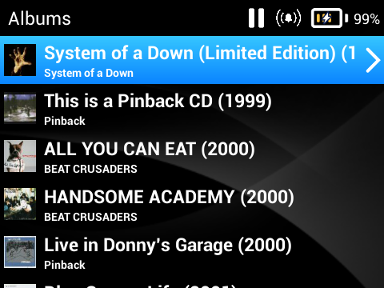

</div>
</details>

<details>
<summary><b>Show albums instead of songs when opening an artist page</b></summary>
<div style="padding: 16px 0 0">

<table border="0" style="border-collapse: collapse; border: none; width: max-content;">
  <!-- Первая строка: Картинки и их отдельные подписи -->
  <tr style="border: none; background: transparent; vertical-align: top;">
        <!-- Первая колонка -->
    <td style="border: none; padding: 0 15px 0 0; width: 1px;">
      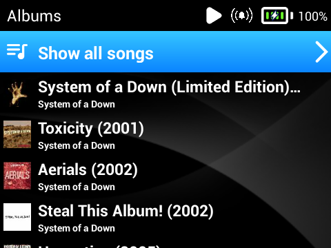
    </td>
    <!-- Вторая колонка -->
    <td style="border: none; padding: 0 0 0 15px; width: 1px;">
      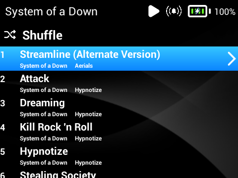
    </td>
  </tr>
  <!-- Вторая строка: Общий текст по центру -->
  <tr style="border: none; background: transparent;">
    <td colspan="2" style="border: none; padding-top: 20px; text-align: center; font-size: 15px; line-height: 1.5;">
      You can use "Show all songs" button to replicate stock behaviour.
    </td>
  </tr>
</table>
</div>
</details>

<details>
<summary><b>"Show all songs" and "Shuffle" buttons in Folders</b></summary>
<div style="padding: 16px 0 0">

<table border="0" style="border-collapse: collapse; border: none;">
  <tr style="border: none; background: transparent; vertical-align: top;">
    <!-- Первая колонка -->
    <td style="border: none; padding: 0 15px 0 0; width: 1px;">
      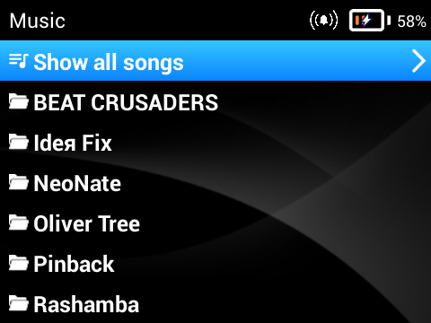
      <div style="padding-top: 8px; font-size: 14px; line-height: 1.4; text-align: center;">
        A folder holding sub-folders gets "Show all songs"
      </div>
    </td>
    <!-- Вторая колонка -->
    <td style="border: none; padding: 0 0 0 15px; width: 1px;">
      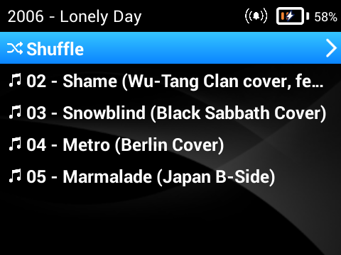
      <div style="padding-top: 8px; font-size: 14px; line-height: 1.4; text-align: center;">
        A folder holding only songs gets "Shuffle"
      </div>
    </td>
  </tr>
</table>
 <br>

</div>
</details>

<details>
<summary><b>Currently playing song indicator</b></summary>
<div style="padding: 16px 0 0">

<table border="0" style="border-collapse: collapse; border: none; width: max-content;">
  <tr style="border: none; background: transparent; vertical-align: top;">
        <!-- Первая колонка -->
    <td style="border: none; padding: 0 15px 0 0; width: 1px;">
      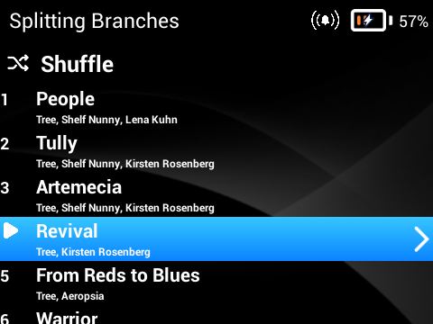
    </td>
</table>
<br>

</div>
</details>

<details>
<summary><b>Option to rename your Bluetooth devices</b></summary>
<div style="padding: 16px 0 0">

<table border="0" style="border-collapse: collapse; border: none; width: max-content;">
  <tr style="border: none; background: transparent; vertical-align: top;">
        <!-- Первая колонка -->
    <td style="border: none; padding: 0 15px 0 0; width: 1px;">
      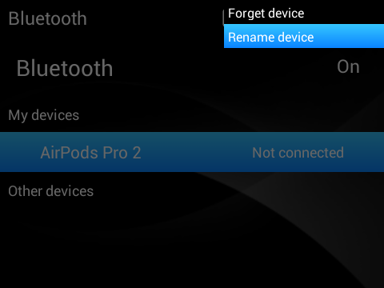
    </td>
</table>
<br>

</div>
</details>

<details>
<summary><b>Library has been moved to its own section in E-books</b></summary>
<div style="padding: 16px 0 0">

<table border="0" style="border-collapse: collapse; border: none; width: max-content;">
  <tr style="border: none; background: transparent; vertical-align: top;">
        <!-- Первая колонка -->
    <td style="border: none; padding: 0 15px 0 0; width: 1px;">
      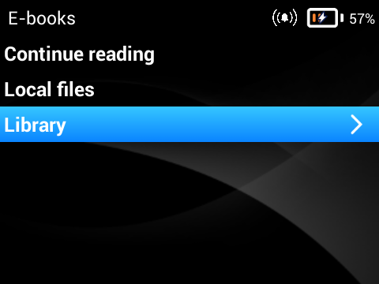
    </td>
</table>
<br>

</div>
</details>

<details>
<summary><b>Manual album thumbnail selection</b></summary>
<div style="padding: 16px 0 0">

<table border="0" style="border-collapse: collapse; border: none; margin: 0; width: auto;">
  <!-- ВЕРХНИЙ РЯД: ДВЕ КАРТИНКИ -->
  <tr style="border: none; background: transparent; vertical-align: top;">
    <!-- Первая колонка (без отступа слева) -->
    <td style="border: none; padding: 0 15px 0 0; width: 1px;">
      
      <div style="padding-top: 8px; font-size: 14px; line-height: 1.4; text-align: center;">
        Thumbnail from CD1 is selected by default
      </div>
    </td>
    <!-- Вторая колонка -->
    <td style="border: none; padding: 0 0 0 15px; width: 1px;">
      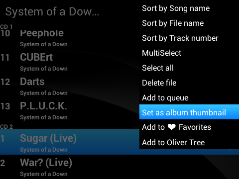
      <div style="padding-top: 8px; font-size: 14px; line-height: 1.4; text-align: center;">
        Changing the thumbnail
      </div>
    </td>
  </tr>

  <!-- ОТСТУП МЕЖДУ РЯДАМИ -->
  <tr style="border: none; background: transparent; height: 20px;">
    <td colspan="2" style="border: none; padding: 0;"></td>
  </tr>

  <!-- НИЖНИЙ РЯД: ТРЕТЬЯ И ЧЕТВЕРТАЯ КАРТИНКИ РЯДОМ -->
  <tr style="border: none; background: transparent; vertical-align: top;">
    <td colspan="2" style="border: none; padding: 0; text-align: center;">
      <!-- Внутренняя таблица для идеального выравнивания пары снизу -->
      <table border="0" style="border-collapse: collapse; border: none; margin: 0 auto; display: inline-table; width: auto;">
        <tr style="border: none; background: transparent; vertical-align: top;">
          <!-- Третья картинка -->
          <td style="border: none; padding: 0 15px 0 0; width: 1px;">
            
            <div style="padding-top: 8px; font-size: 14px; line-height: 1.4; text-align: center;">
              Thumbnail from CD2 is selected
            </div>
          </td>
          <!-- Четвертая картинка -->
          <td style="border: none; padding: 0 0 0 15px; width: 1px;">
            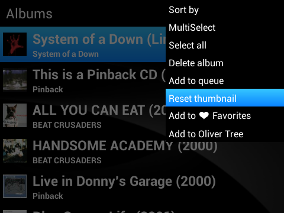
            <div style="padding-top: 8px; font-size: 14px; line-height: 1.4; text-align: center;">
              Resetting to default, only visible if the thumbnail was manually set
            </div>
          </td>
        </tr>
      </table>
    </td>
  </tr>
</table>

</div>
</details>

<p style="display: flex; align-items: center">
<span style="display: inline-block; width: 17px; font-size: 0.85em; user-select: none;">●</span>
<span><b>Optimized album cover previews</b> — no more crashes, no need to resize covers manually</span></p>

<p style="display: flex; align-items: center">
<span style="display: inline-block; width: 17px; font-size: 0.85em; user-select: none;">●</span>
<span><b>"Open album", "Open artist", "Open source" buttons in context menu</b></span></p>

<p style="display: flex; align-items: center">
<span style="display: inline-block; width: 17px; font-size: 0.85em; user-select: none;">●</span>
<span><b>"Sort by Date added"</b> — for songs within playlists</span></p>

<p style="display: flex; align-items: center">
<span style="display: inline-block; width: 17px; font-size: 0.85em; user-select: none;">●</span>
<span><b>"Sort by Release year"</b> — for albums</span></p>

<p style="display: flex; align-items: center">
<span style="display: inline-block; width: 17px; font-size: 0.85em; user-select: none;">●</span>
<span><b>Reboot button</b></span></p>

<p style="display: flex; align-items: center">
<span style="display: inline-block; width: 17px; font-size: 0.85em; user-select: none;">●</span>
<span><b>/Music/ and /Videos/ are opened by default in Folders</b> — instead of the SD card root</span></p>

<p style="display: flex; align-items: center">
<span style="display: inline-block; width: 17px; font-size: 0.85em; user-select: none;">●</span>
<span><b>Genres and Search menu rework</b> — revised to reflect the changes and align with the other sections</span></p>

### System

<details>
<summary>⚙️ <b>Favorites system</b></summary>
<div style="padding: 16px 0 0">

<table border="0" style="border-collapse: collapse; border: none; width: max-content;">
  <!-- Первая строка: Картинки и их отдельные подписи -->
  <tr style="border: none; background: transparent; vertical-align: top;">
        <!-- Первая колонка -->
    <td style="border: none; padding: 0 15px 0 0; width: 1px;">
      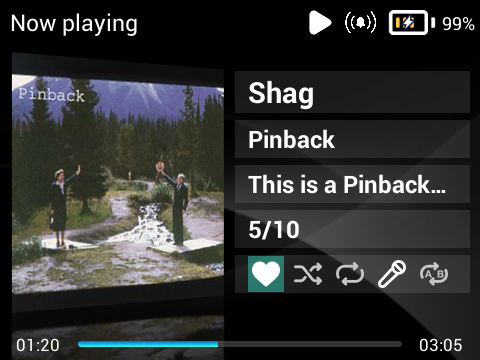
      <div style="padding-top: 8px; font-size: 14px; line-height: 1.4; text-align: center;">
        You can add and remove songs from your favorites by tapping the heart icon in Now Playing
      </div>
    </td>
    <!-- Вторая колонка -->
    <td style="border: none; padding: 0 0 0 15px; width: 1px;">
      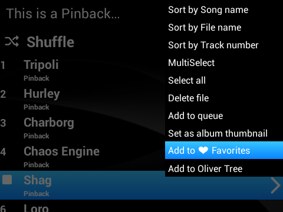
      <div style="padding-top: 8px; font-size: 14px; line-height: 1.4; text-align: center;">
        Alternatively, you can add songs to the "Favorites" playlist just as you would to any other playlist; the likes will be added or removed automatically
      </div>
    </td>

  </tr>
  <!-- Вторая строка: Общий текст по центру -->
  <tr style="border: none; background: transparent;">
    <td colspan="2" style="border: none; padding-top: 20px; text-align: center; font-size: 15px; line-height: 1.5;">
      When you turn off this setting, the playlist and the likes you've given aren't deleted - they're simply hidden
    </td>
  </tr>
</table>
</div>
</details>

<details>
<summary>⚙️ <b>After deleting a song also delete the folder it was stored in</b> — only if it is empty</summary>
<div style="padding: 16px 0 0">

When songs or albums are deleted, the folders that held them are deleted as well, if they are left
empty.

A folder holding nothing but external covers (`cover.*` and `folder.*`), lyrics (`*.lrc`) and empty
folders counts as empty and goes too.

This does not apply to the Folders section, where deleting works as usual.
</div>
</details>

<details>
<summary>⚙️ <b>Better keyboard and typing</b> — case switch, caps lock, three layouts</summary>
<div style="padding: 16px 0 0">

<table border="0" style="border-collapse: collapse; border: none; width: max-content;">
  <!-- Первая строка: Картинки и их отдельные подписи -->
  <tr style="border: none; background: transparent; vertical-align: top;">
        <!-- Первая колонка -->
    <td style="border: none; padding: 0 15px 0 0; width: 1px;">
      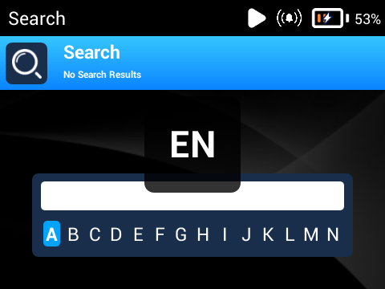
    </td>
    <!-- Вторая колонка -->
    <td style="border: none; padding: 0 0 0 15px; width: 1px;">
      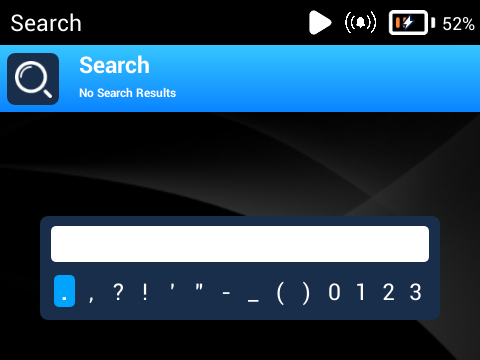
    </td>
</table>
<br>

- Top button hold — change the keyboard layout
- Play button press — switch between uppercase/lowercase letters
- Play button hold — CapsLock
</div>
</details>

<p style="display: flex; align-items: center">
<span style="display: inline-block; width: 17px; font-size: 0.85em; user-select: none;">●</span>
<span>⚙️ <b>Disable auto screen lock while reading lyrics and books</b></span></p>

<details>
<summary><b>Play queue implementation</b></summary>
<div style="padding: 16px 0 0">

<table border="0" style="border-collapse: collapse; border: none;">
  <tr style="border: none; background: transparent; vertical-align: top;">
    <!-- Первая колонка -->
    <td style="border: none; padding: 0 15px 0 0; width: 1px;">
      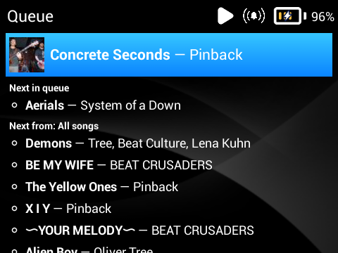
      <div style="padding-top: 8px; font-size: 14px; line-height: 1.4; text-align: center;">
        Depending on your settings, you can open the queue by pressing the top button in "Now Playing" screen or by using the corresponding interactive button
      </div>
    </td>
    <!-- Вторая колонка -->
    <td style="border: none; padding: 0 0 0 15px; width: 1px;">
      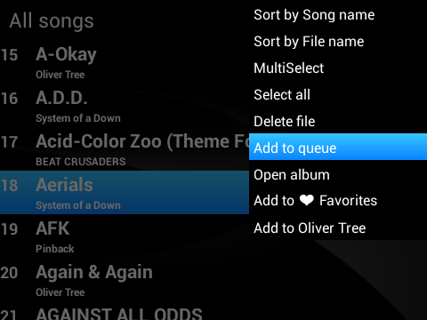
      <div style="padding-top: 8px; font-size: 14px; line-height: 1.4; text-align: center;">
        You can add a song to the queue using the 'Add to Queue' button in the context menu, which appears almost everywhere. A queued track slots in right after the current song
      </div>
    </td>
  </tr>
</table>
 <br>
</div>
</details>

<details>
<summary><b>A proper cache system</b> — no more text and images blinking, system works faster</summary>
<div style="padding: 16px 0 0">

<table border="0" style="border-collapse: collapse; border: none;">
  <tr style="border: none; background: transparent; vertical-align: top;">
    <!-- Первая колонка -->
    <td style="border: none; padding: 0 15px 0 0; width: 1px;">
      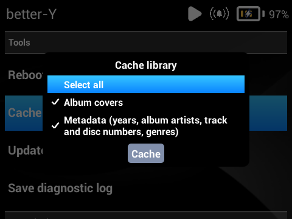
      <div style="padding-top: 8px; font-size: 14px; line-height: 1.4; text-align: center;">
        The cache builds itself as you use the player, and "Cache library" button does the whole library in one go
      </div>
    </td>
    <!-- Вторая колонка -->
    <td style="border: none; padding: 0 0 0 15px; width: 1px;">
      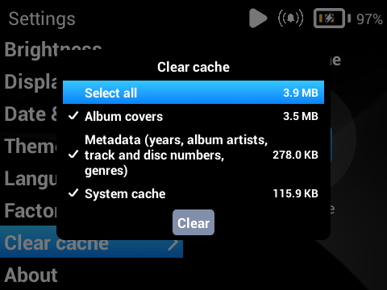
      <div style="padding-top: 8px; font-size: 14px; line-height: 1.4; text-align: center;">
        It costs roughly 4 MB per 1000 songs. It may be larger even with the same number of songs, depending on the number of albums
      </div>
    </td>
  </tr>
</table>
</div>
</details>

<details>
<summary><b>Existing song navigation logic changes</b></summary>
<div style="padding: 16px 0 0">

The track-switching functionality, repeat and shuffle behavior have been updated. <br>
Also, selecting a currently playing song from the list no longer starts it from the beginning
</div>
</details>

<p style="display: flex; align-items: center">
<span style="display: inline-block; width: 17px; font-size: 0.85em; user-select: none;">●</span>
<span><b>Based on 3.1.2 firmware</b> — AirPods fix included</span></p>

<p style="display: flex; align-items: center">
<span style="display: inline-block; width: 17px; font-size: 0.85em; user-select: none;">●</span>
<span><b>Themes support</b> — themes work as usual, and everything new adapts to them</span></p>

<p style="display: flex; align-items: center">
<span style="display: inline-block; width: 17px; font-size: 0.85em; user-select: none;">●</span>
<span><b>Scroll and overall optimizations</b> — every menu is faster and more responsive, the library scans quicker</span></p>

<p style="display: flex; align-items: center">
<span style="display: inline-block; width: 17px; font-size: 0.85em; user-select: none;">●</span>
<span><b>Double press of the play button opens "Now Playing"</b> — from everywhere</span></p>

<p style="display: flex; align-items: center">
<span style="display: inline-block; width: 17px; font-size: 0.85em; user-select: none;">●</span>
<span><b>"Update library"</b> — re-reads metadata and cover art for songs already in the library if you have changed it</span></p>

<p style="display: flex; align-items: center">
<span style="display: inline-block; width: 17px; font-size: 0.85em; user-select: none;">●</span>
<span><b>Force reboot</b> — press and hold the top + bottom buttons</span></p>

<p style="display: flex; align-items: center">
<span style="display: inline-block; width: 17px; font-size: 0.85em; user-select: none;">●</span>
<span><b>"File extensions" setting fix</b> — folder names are no longer erased after a dot</span></p>

<p style="display: flex; align-items: center">
<span style="display: inline-block; width: 17px; font-size: 0.85em; user-select: none;">●</span>
<span><b>UI, translations and text fixes</b></span></p>

<p style="display: flex; align-items: center">
<span style="display: inline-block; width: 17px; font-size: 0.85em; user-select: none;">●</span>
<span><b>Improved support for text encodings</b> — for Cyrillic, Greek, Hebrew and Thai</span></p>

<p style="display: flex; align-items: center">
<span style="display: inline-block; width: 17px; font-size: 0.85em; user-select: none;">●</span>
<span><b>Russian now supports fonts from custom themes</b></span></p>

<p style="display: flex; align-items: center">
<span style="display: inline-block; width: 17px; font-size: 0.85em; user-select: none;">●</span>
<span><b>And a lot of other minor fixes and corrections</b></span></p>

****

## Before you install

- **Innioasis Y1, Type A only.**
- **If you have used any other custom firmware, a clean install is recommended.**

## Install

- **Options A, B and C (without step 4) write the whole firmware, `usrdata` included**: settings, playlists, likes, reading progress, bookmarks. Your files on the SD card are untouched.
- If you have stock 3.0.7 or 3.1.2 firmware installed (anything lower wasn't tested) and want to keep your `usrdata` - use Option C with step 4.

### Option A — [Updater CE](https://innioasis.app/) by Ryan Specter (`rom.zip`)

Download `rom.zip` from the Releases page, open the updater, press "Browse Files", choose the archive or drag and drop it and follow instructions on screen.

### Option B — [Official Innioasis Updater](https://www.reddit.com/r/innioasis/comments/1v9vsvj/comment/p0nfp8g/?utm_source=share&utm_medium=web3x&utm_name=web3xcss&utm_term=1&utm_content=share_button/) (`rom.zip`)

Download `rom.zip` from the Releases page, open the updater, press "Choose Package", choose the archive, press "Start Flash" and follow instructions on screen.

### Option C — SP Flash Tool (`rom.zip`)

1. Download `rom.zip` from the Releases page, extract it
2. Open the SP Flash Tool, press "choose" and locate Download-Agent (`/SP_Flash_Tool/MTK_AllInOne_DA.bin`) and Scatter-loading File (`MT6572_Android_scatter.txt`)
3. Make sure that "Download Only" is set
4. (Optional, if you already have stock 3.0.7 or 3.1.2 installed) Uncheck everything except for ANDROID (`system.img`)
5. Disconnect the player from the PC (if it's connected), then turn it off
6. Press Download
7. Connect the player to the PC and wait for the installation to complete

## Reporting a bug

- After the bug occurs, open "better-Y" → [Tools] → "Save diagnostic log". Create an issue, describe the bug and attach the log file. If possible, include the steps to reproduce it. 

## Building it yourself

### Step 1 — collect the inputs

- `com.innioasis.y1_3.1.2.apk` from your own device or from stock 3.1.2 firmware (`/system/app/`) —
  MD5 `C342B4A8DEAEF2700FE8EBBB2C299F5C`, 58 997 249 bytes;
- **apktool 2.11.1** exactly — a unified diff only applies to an identically decompiled tree;
- a JDK, plus `zipalign` and `apksigner` from any Android build-tools;
- the AOSP platform testkey `platform.pk8` and `platform.x509.pem`, into `build/keys/`. 
- [the stock 3.1.2 firmware archive](https://github.com/y1-community/y1-stock-rom/releases/tag/Latest-3.1.2), in `ROM/` under exactly this name:
  `y1-community_y1-stock-rom_Latest-3.1.2.zip` — the same one Updater  CE installs as clean firmware;
- a Linux userland for the image work — `python3`, `simg2img`, `debugfs` and `e2fsck`. On Windows,
  WSL covers it.

### Step 2 — build the APK

```
apktool d -f -o tree com.innioasis.y1_3.1.2.apk   # decompile the stock launcher
./build/patch.sh --apply tree                     # apply this repository onto it
./build/ipp-java.sh                               # compile the Java sources into smali
./build/build.sh                                  # build, sign, verify
```

On Windows the same four steps are `patch.ps1 -Apply tree`, `ipp-java.ps1`, `build.ps1` — the two
sets of scripts do the same work in the same order. Each looks for its tools in an environment
variable first, then under `build/tools` and `build/sdk`, then on `PATH`; the comment at the top of
`build/lib.sh` names them. The finished APK lands in `build/out/`.

### Step 3 — build `rom.zip`

```
./build/rom.sh                                    # on Windows: build\rom.ps1
```

It takes the newest APK from `build/out`, puts it into the `system.img` of the community base
(`debugfs`, no mounting and no root), packs that together with the rest of the factory 3.1.2 set,
and writes `build/rom-out/rom.zip`. Every step checks itself: the launcher is read back out of the
image and compared with the APK, `e2fsck` runs over the result, and the sparse image is expanded
again and compared byte for byte with the raw one. It takes about a minute.

### Step 4 — install it

## What's in this repository

The mod is a set of edits to a stock launcher. So what you get is the difference and the exact recipe to reproduce it:

| | |
|---|---|
| `files/` | code and resources, plus the stock binaries the mod replaces |
| `stock.diff` | a unified diff of the stock files |
| `delete.txt` | stock files the mod removes |
| `manifest.json` | the pinned inputs: apktool version, the factory APK's name, size and MD5 |
| `build/` | the build scripts, in PowerShell and bash alike, and the Java sources they compile |
| `build/rom-tools/` | the python that packs `system.img` and builds the boot images |
| `screenshots/` | the pictures on this page |
| `LICENSE` | MIT, and what it does and does not cover |

`./build/patch.sh --verify` (or `patch.ps1 -Verify`) proves the set is complete: it decompiles the
factory APK, applies everything here, and compares the result against the tree you actually build
from.

## License

better-Y is released under the [MIT License](LICENSE), Copyright (c) 2026 better-Y Team. That
license covers **only what was written for this project** — the code and resources added to the
launcher, and the build scripts here.

Everything else keeps its own. The Innioasis Y1 launcher and the firmware it ships with are
proprietary software of INNIOASIS; **all rights in that code belong to its authors**, this project
only modifies it, and no license of ours applies to any of it. The same goes for the third-party
libraries inside the launcher, which carry the licenses of their own authors. `LICENSE` says in
full which part is which. No affiliation with or endorsement by INNIOASIS is claimed.

**The software is provided "as is", without warranty of any kind.** Installing it means replacing
your device's system partition, and you do so at your own risk: in no event are the authors liable
for any damage, data loss or bricked hardware arising from it.